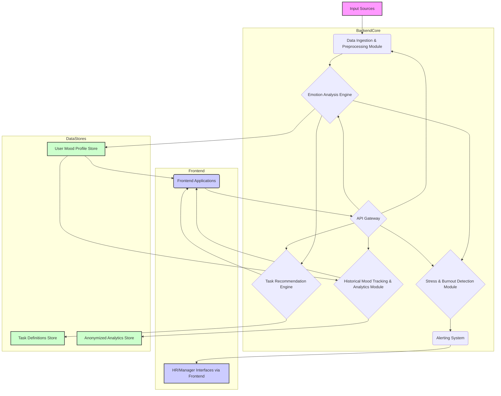

# System Patterns: TaskNova

## 1. Architectural Approach

A **Modular Monolith** architecture is proposed for the initial development phase, balancing development speed with future scalability. Key modules will be designed with clear interfaces, allowing them to be potentially extracted into microservices later if needed.

## 2. Core System Modules

- **Data Ingestion & Preprocessing Module:** Collects and prepares data from various inputs (text, video stream for facial expressions, audio stream for speech).
- **Emotion Analysis Engine:** Core ML module using models for text sentiment analysis, facial emotion recognition (FER), and speech emotion recognition (SER). Outputs structured emotion/mood data.
- **Task Recommendation Engine:** Uses detected mood, user preferences, historical data, and task characteristics to suggest suitable tasks.
- **Historical Mood Tracking & Analytics Module:** Stores mood data over time, generates individual and team-level analytics and visualizations.
- **Stress & Burnout Detection Module:** Analyzes mood patterns to identify prolonged negative states or significant deviations, triggering alerts.
- **Alerting System:** Manages and dispatches notifications to HR/managers based on triggers from the detection module.
- **API Gateway:** Single entry point for all frontend requests, routing them to appropriate backend services/modules.
- **User Mood Profile Store:** Database for storing individual user profiles, current mood, and detailed mood history.
- **Task Definitions Store:** Database for storing available tasks, their characteristics, and potential mood alignments.
- **Anonymized Analytics Store:** Database for storing aggregated and anonymized mood data for team-level and organizational analytics, ensuring privacy.
- **Frontend Applications:** Web-based interfaces for employees, HR, and managers, designed with a dark mode UX.

## 3. Key Design Patterns

- **Model-View-Controller (MVC) / Model-View-ViewModel (MVVM):** For structuring the frontend application.
- **Repository Pattern:** To abstract data access logic for different data stores.
- **Observer Pattern:** For the alerting system to notify relevant parties upon event triggers (e.g., stress detection).
- **Strategy Pattern:** Could be used within the Emotion Analysis Engine to switch between different analysis techniques (text, video, audio) or models.
- **Data Anonymization/Pseudonymization:** Critical for protecting user privacy in the analytics module and data stores.
- **Secure by Design:** Incorporate security best practices throughout the development lifecycle, including input validation, secure API authentication/authorization (e.g., OAuth 2.0, JWT), and protection against common web vulnerabilities (OWASP Top 10).

## 4. UI/UX Patterns

- **Dark Mode First:** All UI components designed primarily for a dark theme, ensuring high contrast and readability.
- **Progressive Disclosure:** Show users only relevant information, avoiding clutter, especially for task recommendations and mood insights.
- **Feedback Mechanisms:** Provide clear feedback for user actions and system processes (e.g., when mood is analyzed or a task is recommended).
- **Personalized Dashboards:** Tailored views for employees (mood, tasks), HR (team analytics, alerts), and managers (team mood, alerts).
- **Visualizations:** Use charts and graphs for historical mood tracking and team analytics to make data easily digestible.

## 5. Data Management & Privacy

- **Consent Management:** Obtain explicit user consent for data collection and processing, especially for sensitive data like facial expressions and speech.
- **Data Minimization:** Collect only necessary data.
- **Role-Based Access Control (RBAC):** Ensure users can only access data and features appropriate to their role.
- **Secure Storage:** Encrypt sensitive data at rest and in transit.
- **Regular Audits:** Plan for regular security and privacy audits.
